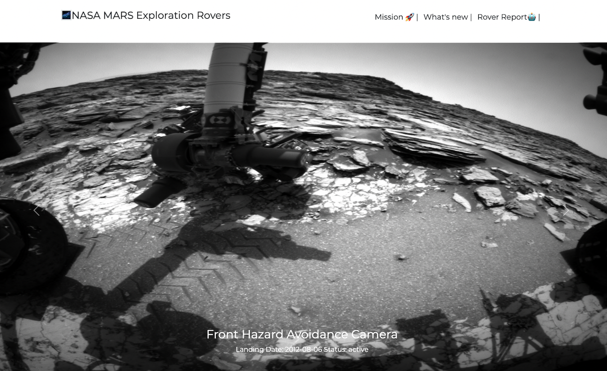

## Mars Rover Photos
Uses NASA's API to display images data gathered by NASA's Curiosity, Opportunity, and Spirit rovers on Mars.

Photos are organized by the sol (Martian rotation or day) on which they were taken, counting up from the rover's landing date. 


### Run Locally

Clone the project

```bash
  git clone git@github.com:N-Musa/Mars_rover.git
```

Go to the project directory

```bash
  cd <folder>
```

Install dependencies

```bash
  npm install
```

Start the server

```bash
  npm run dev
```
### Screenshots




